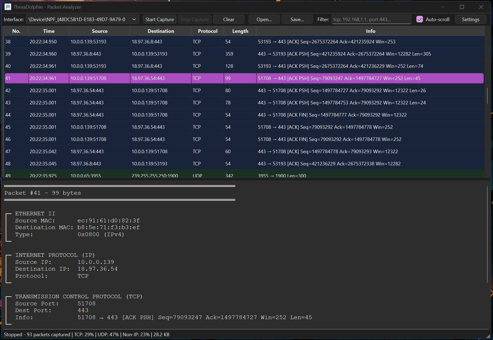

# ThreaDolphin - Network Packet Analyzer

A cross-platform packet capture and analysis tool built with C++ and Qt. Captures live network traffic, parses protocol headers, and exports to industry-standard PCAP format.


## Features

**Capture & Analysis**
- Real-time packet capture with multi-threaded architecture
- Protocol parsing: Ethernet, IPv4, TCP, UDP, ICMP
- Hex dump viewer with ASCII representation
- Live statistics (protocol distribution, bandwidth)
- Follow TCP Stream - isolate and reassemble individual TCP connections

**Filtering & Search**
- Text-based packet filtering (protocol, IP, port)
- Color-coded protocol display
- Configurable packet buffer (1K - 100K+ packets)

**Import/Export**
- Save/load PCAP files (Wireshark-compatible)
- Copy packet data (summary, details, hex dump)
- Right-click context menus

**UX Features**
- Auto-scroll toggle for live captures
- Keyboard shortcuts (Cmd/Ctrl+R, Cmd/Ctrl+F, Cmd/Ctrl+E)
- Persistent settings
- Native app bundles (.app on macOS, .exe with icon on Windows)

## Build Instructions

### Prerequisites

**macOS:**
```bash
brew install qt@6 cmake
```

**Linux (Debian/Ubuntu):**
```bash
sudo apt-get install qt6-base-dev libpcap-dev cmake build-essential
```

**Windows:**
- Install [Qt6 for MSVC](https://www.qt.io/download) (select MSVC 2022 64-bit)
- Install [Npcap](https://npcap.com/#download) (check "Install in WinPcap API-compatible Mode")
- Download [Npcap SDK](https://npcap.com/#download) and extract to `C:\npcap-sdk-1.16`
- Install [CMake](https://cmake.org/download/)
- Install [Visual Studio 2022](https://visualstudio.microsoft.com/) (Community Edition with C++ tools)

### Compile

**macOS/Linux:**
```bash
git clone https://github.com/muhammadxrahman/threadolphin.git
cd threadolphin
mkdir build && cd build
cmake ..
make
```

**Windows:**
```powershell
git clone https://github.com/muhammadxrahman/threadolphin.git
cd threadolphin
mkdir build
cd build
cmake .. -DCMAKE_PREFIX_PATH="C:/Qt/6.10.2/msvc2022_64"
cmake --build . --config Release

# Deploy Qt DLLs (makes .exe portable)
C:\Qt\6.10.2\msvc2022_64\bin\windeployqt.exe .\Release\ThreaDolphin.exe
```

### Run

**macOS:**
```bash
# As app bundle
sudo open ThreaDolphin.app

# Or directly
sudo ./ThreaDolphin.app/Contents/MacOS/ThreaDolphin
```

**Linux:**
```bash
sudo ./ThreaDolphin  # Requires root for packet capture
```

**Windows:**
```powershell
# Run from Release folder
cd build\Release

# Right-click ThreaDolphin.exe → Run as Administrator
# Or from PowerShell:
Start-Process -FilePath "ThreaDolphin.exe" -Verb RunAs
```

## Architecture

- **Capture Thread:** Non-blocking packet capture using libpcap/Npcap
- **Qt Model/View:** Separation of data and presentation with proxy filtering
- **Packet Parser:** Manual protocol dissection (Ethernet/IP/TCP/UDP headers)
- **Circular Buffer:** Memory-efficient storage with configurable limits
- **Stream Reassembly:** TCP connection tracking and payload reconstruction

## Technical Highlights

- Multi-threaded design prevents UI blocking during capture
- Thread-safe communication via Qt signals/slots
- QSortFilterProxyModel for real-time filtering without data copies
- Standard PCAP file format for Wireshark interoperability
- TCP stream isolation using 4-tuple matching (src/dst IP:port)
- Bidirectional payload reassembly with sequence ordering
- Cross-platform CMake build system with platform-specific optimizations
- Native app bundles (.app on macOS, .exe with embedded icon on Windows)
- Platform abstraction: libpcap (Unix) / Npcap (Windows)

## Key Features Explained

### Follow TCP Stream
Right-click any TCP packet and select "Follow TCP Stream" to:
- Filter and display only packets belonging to that connection
- Reassemble the conversation with client/server sections color-coded
- View application-layer data (HTTP requests/responses, etc.)
- Useful for debugging protocols and analyzing network conversations

### Real-time Filtering
Type any text in the filter box to instantly search across:
- Protocol names (tcp, udp, icmp)
- IP addresses (complete or partial)
- Port numbers
- Packet info/details

### PCAP Compatibility
Export captured packets to standard PCAP format for analysis in Wireshark or other tools. Import existing PCAP files to analyze offline captures.

## Project Structure
```
ThreaDolphin/
├── CMakeLists.txt                # Cross-platform build configuration
├── src/
│   ├── main.cpp
│   ├── MainWindow.cpp/h          # Main application window
│   ├── PacketCapture.cpp/h       # libpcap/Npcap wrapper
│   ├── CaptureThread.cpp/h       # Threaded packet capture
│   ├── PacketModel.cpp/h         # Qt table model
│   ├── PacketParser.cpp/h        # Protocol dissection
│   ├── Packet.h                  # Packet data structures
│   ├── SettingsDialog.cpp/h      # Configuration UI
│   ├── StreamWindow.cpp/h        # TCP stream viewer
│   └── StreamIdentifier.h        # Stream matching logic
└── resources/
    ├── ThreaDolphin.icns         # macOS icon
    ├── ThreaDolphin.ico          # Windows icon
    ├── windows_icon.rc           # Windows resource script
    └── Info.plist.in             # macOS bundle metadata
```

## Keyboard Shortcuts

- **Cmd/Ctrl + R** - Start/Stop capture
- **Cmd/Ctrl + K** - Clear packets
- **Cmd/Ctrl + F** - Focus filter box
- **Cmd/Ctrl + O** - Open PCAP file
- **Cmd/Ctrl + E** - Export/Save PCAP file
- **Cmd/Ctrl + ,** - Settings
- **Cmd/Ctrl + C** - Copy selected packet

## Screenshots
**Compatible with Windows**

**Capturing Packets**

**Filter packets via text search**

**View packet details upon click**

**Import and export PCAP files to view**


## Known Limitations

- Requires administrator/root privileges for packet capture
- IPv6 not currently supported (IPv4 only)
- Encrypted traffic (HTTPS/TLS) shows only TCP handshake, not decrypted payload

## Future Enhancements

- IPv6 support
- Additional protocol support (ARP, IPv6, DNS)

## License

MIT

## Acknowledgments

Inspired by Wireshark. Built with Qt.