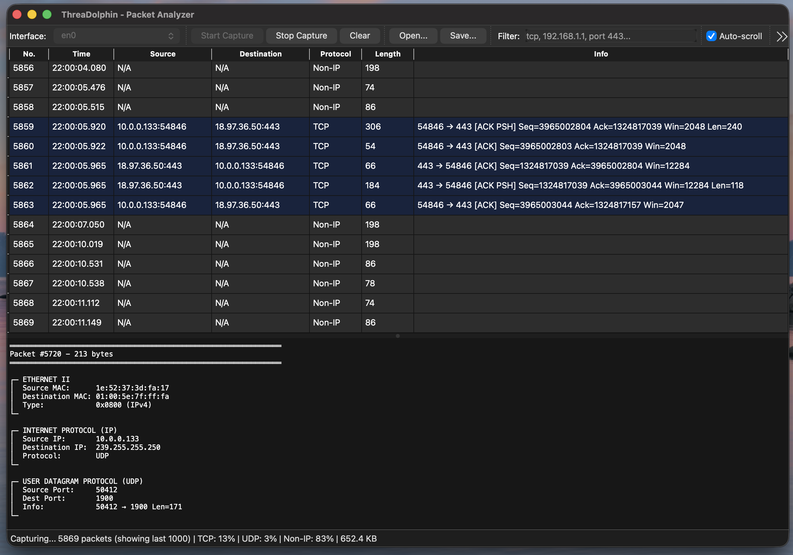
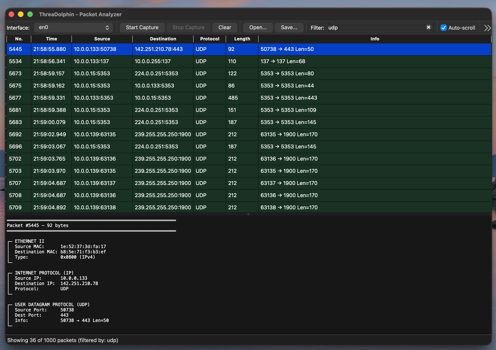
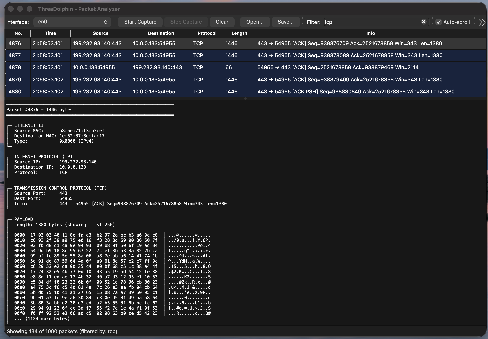
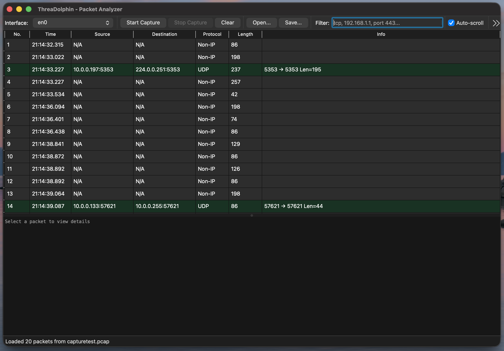

# ThreaDolphin - Network Packet Analyzer

A cross-platform packet capture and analysis tool built with C++ and Qt. Captures live network traffic, parses protocol headers, and exports to industry-standard PCAP format.


## Features

**Capture & Analysis**
- Real-time packet capture with multi-threaded architecture
- Protocol parsing: Ethernet, IPv4, TCP, UDP, ICMP
- Hex dump viewer with ASCII representation
- Live statistics (protocol distribution, bandwidth)

**Filtering & Search**
- Text-based packet filtering (protocol, IP, port)
- Color-coded protocol display
- Configurable packet buffer (1K - 100K+ packets)

**Import/Export**
- Save/load PCAP files (Wireshark-compatible)
- Copy packet data (summary, details, hex dump)
- Right-click context menus

**UX Features**
- Auto-scroll toggle for live captures
- Keyboard shortcuts (Cmd/Ctrl+R, Cmd/Ctrl+F, Cmd/Ctrl+E)
- Persistent settings
- Native macOS .app bundle with custom icon

## Build Instructions

### Prerequisites

**macOS:**
```bash
brew install qt@6 libpcap cmake
```

**Linux:**
```bash
sudo apt-get install qt6-base-dev libpcap-dev cmake build-essential
```

**Windows:**
- Install Qt6 (from qt.io)
- Install Npcap (WinPcap API-compatible mode)
- Install CMake

### Compile
```bash
git clone https://github.com/muhammadxrahman/threadolphin.git
cd threadolphin
mkdir build && cd build
cmake ..
make
```

### Run

**macOS:**
```bash
# As app bundle
sudo open ThreaDolphin.app

# Or directly
sudo ./ThreaDolphin.app/Contents/MacOS/ThreaDolphin
```

**Linux:**
```bash
sudo ./ThreaDolphin  # Requires root for packet capture
```

**Windows:**
Right-click → Run as Administrator

## Architecture

- **Capture Thread:** Non-blocking packet capture using libpcap
- **Qt Model/View:** Separation of data and presentation
- **Proxy Model:** Real-time filtering without data modification
- **Packet Parser:** Manual protocol dissection (no third-party libraries)

## Technical Highlights

- Multi-threaded design (GUI thread + capture thread)
- Thread-safe packet queue with Qt signals/slots
- Circular buffer for memory-efficient long captures
- Standard PCAP file format implementation
- Cross-platform CMake build system
- Native app bundles (.app on macOS)

## Project Structure
```
ThreaDolphin/
├── CMakeLists.txt
├── src/
│   ├── main.cpp
│   ├── MainWindow.cpp/h
│   ├── PacketCapture.cpp/h      # libpcap wrapper
│   ├── CaptureThread.cpp/h       # Threaded capture
│   ├── PacketModel.cpp/h         # Qt table model
│   ├── PacketParser.cpp/h        # Protocol dissection
│   ├── Packet.h                  # Data structures
│   └── SettingsDialog.cpp/h      # Configuration UI
└── resources/
    ├── ThreaDolphin.icns         # macOS icon
    └── Info.plist.in             # macOS bundle metadata
```

## Screenshots

**Capturing Packets**

**Filter packets via text search**

**View packet details upon click**

**Import and export PCAP files to view**


## Known Limitations

- Requires administrator/root privileges for packet capture
- IPv6 not currently supported (IPv4 only)
- TCP stream reassembly not implemented

## Future Enhancements

- Windows build and testing
- Follow TCP Stream feature
- Live bandwidth graphing
- Additional protocol support (ARP, IPv6, DNS)

## License

MIT

## Acknowledgments

Inspired by Wireshark.